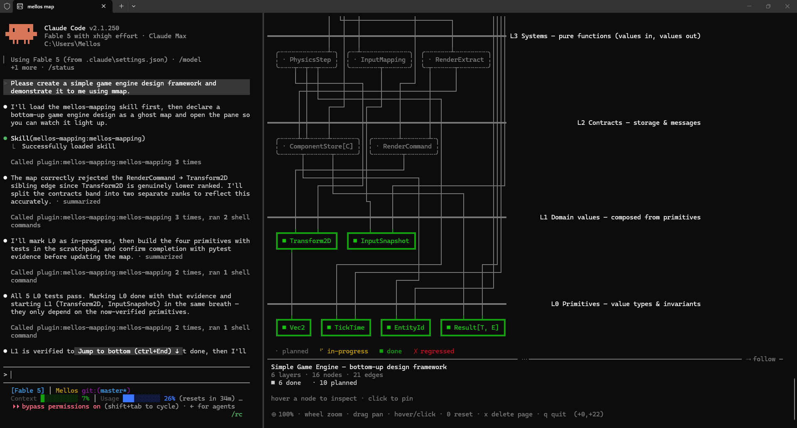

# Mellos Mapping

[](https://www.npmjs.com/package/mellos-mapping)
[](https://www.npmjs.com/package/mellos-mapping)
[](https://registry.modelcontextprotocol.io/v0/servers?search=io.github.GuangminJu/mellos-mapping)
[](https://github.com/GuangminJu/mellos-mapping/actions/workflows/ci.yml)
[](LICENSE)

English | [简体中文](README.zh-CN.md)

A live, terminal-native map of bottom-up development for
[Claude Code](https://claude.com/claude-code), ChatGPT desktop Codex mode and Codex CLI.

<p align="center">
  <picture>
    <source media="(prefers-color-scheme: light)" srcset="docs/demo-light.svg">
    
  </picture>
</p>

While Claude builds your system, a split pane beside the conversation shows
the system's **layered dependency map**: primitive layers at the bottom,
dependency edges that may only point downward, ghost nodes for what is
designed, a spinner on what is being built right now, and solid green for
what is built *and verified*.

<p align="center">
  
</p>

*A real session: Claude Code on the left, the map pane on the right. L0 is
verified, L1 just lit up, everything above is still a ghost.*

## Why

Most progress reporting is a task list — a top-down worldview. A Mellos map
grows the other way: an upper node can only stand on nodes below it, and the
picture makes the discipline visible:

- **The ghost design appears before any code.** Claude declares the whole
  intended structure as dashed ghost nodes first; you can veto a bad design
  while it is still only a picture.
- **The spinner is where Claude's attention is.** One glance answers "what is
  it doing right now, and on top of what?"
- **Done means verified.** A node turns solid green only with evidence (a
  passing test run). If later work cracks a foundation, the node turns red —
  a cracked foundation under a spinning upper floor is the most honest status
  report there is.
- **The map is a ledger, not a judge.** The tools refuse only structural
  corruption (an edge pointing upward, a duplicate rank). Workflow is
  Claude's discipline, defined in the bundled skill; violations are made
  *visible*, never silently blocked.

## Install

Clone the branch for your host, then run one command. No build is required.

| Branch | Audience | Command from the clone |
| --- | --- | --- |
| `main` | Shared source / either host | `node install.mjs chatgpt-app` or `node install.mjs claude` |
| `claude` | Claude Code | `node install.mjs` |
| `chatgpt-app` | ChatGPT desktop, Codex mode | `node install.mjs` |

Requires Node.js 18.17+ on the 18.x line, or 20.3+, and the corresponding host CLI
on PATH. Supported platforms are Windows 10+, macOS 13.0+ and Linux with glibc
2.28+, each on x64 or arm64. The OS must also meet the selected Node.js version's
requirements. Native lock bindings ship with the release; no local compilation
is needed. The installer checks
release integrity and all eight MCP tools, retains the runtime outside the clone,
and configures the host. Start a new conversation after installation.
See [release and branch instructions](docs/releasing.md).

Claude Code's marketplace installation is also available:

Two lines inside any Claude Code conversation:

```
/plugin marketplace add GuangminJu/mellos-mapping
/plugin install mellos-mapping@mellos-mapping
```

Or one line in a terminal:

```
claude plugin marketplace add GuangminJu/mellos-mapping && claude plugin install mellos-mapping@mellos-mapping
```

Requires the same [Node.js and platform versions](#install) on PATH (install
Node separately when using native Claude Code). No build step: `dist/` is
committed, so a clone runs as-is —
`dist/server.mjs` (the MCP server), `dist/watch.mjs` (the pane),
`dist/mmap.mjs` (the `mmap` toggle), `dist/hook-session-start.mjs` (the
`SessionStart` hook that `hooks/hooks.json` registers) and
`dist/store-paths.mjs` (the store's path vocabulary, which the plain-node pane
launcher imports instead of restating filenames).

**omp (Oh My Pi)** reads the same plugin layout the Claude Code edition ships —
the same marketplace catalog, `.mcp.json`, skill and slash command — so one
release serves both hosts:

```
omp plugin marketplace add GuangminJu/mellos-mapping
omp plugin install mellos-mapping@mellos-mapping
```

That install follows `main`, where a release is a version bump. To freeze a
version instead, add a checkout of one — the Claude Code edition ZIP from the
GitHub Release, or a clone at the release tag:

```
omp plugin marketplace add "<checkout or extracted release directory>"
omp plugin install mellos-mapping@mellos-mapping
```

omp never reads `hooks/hooks.json`, so the session paragraph arrives through the
plugin's omp host adapter (`dist/omp-extension.mjs`, declared in
`package.json#omp.extensions`): the same store, the same policy text, and the
same `mmap` shim install as the Claude hook. The pane is the same terminal
split beside the session. Install it *as a plugin*: neither `omp plugin link`
nor the npm package is a plugin, and both would leave the tools behind. See
[omp installation and limitations](docs/distributions/omp.md).

The first session after installing asks you **one** question — how eager
mapping should be — and records the answer for every project you will ever
open. From then on the hook carries it into each new session by itself; there
is no per-project setup step. See
[Setup: choose when maps open](#setup-choose-when-maps-open).

The `mmap` terminal command (the pane's open/close toggle) installs itself on
Windows: the same hook notices on session start when the shim is missing or
points at an older install, writes `mmap.cmd` (cmd, PowerShell) and `mmap`
(git-bash) into `%LOCALAPPDATA%\mellos-mapping\bin`, appends that one
directory to your **user** PATH, and tells you so through the assistant. The
PATH change reaches only new processes — and a new tab of a running Windows
Terminal inherits the old environment, so close the terminal app entirely and
reopen it before the first `mmap`. The PATH edit keeps the
installer's guarantees: nothing happens when the entry is already there, and
a PATH that `setx` would damage (flattened `%VARIABLE%` references, truncation
past its limit) is refused outright.

A refused PATH is not a dead end: the same two shims are then written into
`%LOCALAPPDATA%\Microsoft\WindowsApps` (or `~/.local/bin`) — a directory your
PATH already names — so `mmap` is runnable in a new terminal with no PATH
change at all. Machines with a long PATH are exactly where that happens, and
where it matters most. The command takes the page to open as an argument
(`mmap omp-host-support`), and closes the pane when it is already open.

The step behind it is still a command of its own, for the cases the hook does
not cover — `--uninstall`, or re-adding a PATH entry you removed while the
shims stayed put:

```
node "<plugin dir>/scripts/install-mmap-command.mjs" [--uninstall]
```

(`--json` prints the install outcome as one JSON line instead of prose — the
mode the hook itself calls it in.) `npm i -g mellos-mapping` provides the
same `mmap` via `bin`, no shims involved.

## Update

```
claude plugin marketplace update mellos-mapping && claude plugin update mellos-mapping@mellos-mapping
```

Two steps because `plugin update` compares against the locally cached
marketplace clone — the first command is what actually pulls this repo.
Restart Claude Code to apply. Releases are version bumps on `main`.
(In-app, `/plugin` opens the same management UI.)

omp updates with its own two steps:

```
omp plugin marketplace update mellos-mapping && omp plugin upgrade mellos-mapping@mellos-mapping
```

Close the pane first (`q` in it): the watcher runs from the plugin copy, and on
Windows an open file cannot be renamed away, so an upgrade attempted while a
pane is open can fail with `EPERM` and leave the plugin cache empty — repaired
by `omp plugin install mellos-mapping@mellos-mapping --force`. Then: the first
command refreshes the catalog, the second reinstalls from it. omp also
refreshes a catalog entry it has not updated for a day at startup, unless
`marketplace.autoUpdate` is `off` — in the default `notify` mode that check
writes its finding to the debug log only, so `marketplace update` is the step
that makes an update visible. `upgrade` does not compare versions: it
force-reinstalls whatever the catalog names, which is why a release is
identified by its version bump rather than gated by it. Restart omp afterwards,
and reopen a pane still showing the old bundle (`q` in it, then `mmap_open`
again).

### Upgrading from 0.19

0.20 moved the store out of `.claude/` — the map belongs to this tool, not to
one client — into `.mellos/`. The server and the watcher each perform the move
once at startup, and print exactly one line on stderr when they do
(`mellos-mapping: moved the legacy .claude map store to .mellos/ — commit the
move.`):

| 0.19 and earlier | 0.20 and later |
| --- | --- |
| `.claude/mellos-mapping.json` | `.mellos/map.json` |
| `.claude/mellos-mapping.pages/` | `.mellos/pages/` |
| `.claude/mellos-mapping.config.json` | `.mellos/config.json` |

Nothing is merged and nothing is overwritten: a project that already has a
`.mellos/` store (map, pages or config) is left untouched, whatever the legacy
directory still holds. If you keep your maps in git, commit the move —
`git add -A .claude .mellos` records it as renames rather than as a pile of
deletions plus untracked files.

That one move is the only time either process touches `.claude/`. Afterwards
the tools write nowhere but `.mellos/`, and never outside the project
directory they resolved at startup.

## ChatGPT App · Codex mode

This is Codex mode in the ChatGPT desktop app (also called Codex App).
From the source branch run the following command; on `chatgpt-app`, omit the
host argument. It configures the desktop skill, marketplace and eight MCP tools.

```
node install.mjs chatgpt-app
```

Start a new conversation. The desktop skill defaults to **web-terminal**:
`mmap_open {surface: "web-terminal", page: "<slug>"}` starts a local service,
then the AI opens its URL in the current conversation's right browser panel.
The mmap terminal starts automatically, with its own font-size selector;
no manual paste or Computer Use is needed. Graphical SVG, native terminal and
Markdown remain available. With an older MCP schema, run
`node "<plugin root>/dist/web.mjs" "<project>" --terminal --page <slug>`.
A queued panel request does not prove that the user can see it.
See [desktop installation and limitations](docs/codex.md).

For Codex CLI inside Windows Terminal (not the desktop integrated terminal), run
`node <plugin root>/scripts/open-pane.mjs <project dir>` — it splits the
terminal window hosting the session, keeping keyboard focus on the conversation.
If that window cannot be identified or focused, it reports failure without
opening elsewhere. `--window` explicitly chooses a separate window. Add
`--page <slug>` to open on a particular page — and with a pane already open,
rerunning with `--page` retargets the pane belonging to this console. A map
open in another session or a separate window does not count as this split. The pane
auto-follows the page being written — the map the agent is operating on
right now; press `f` to toggle that (a manual page switch also turns it
off), or start with `--no-follow`. Elsewhere run
`node <plugin root>/dist/watch.mjs` from the project directory in a second
terminal (or any terminal split). Both take the same flags — see
[Pane flags](#pane-flags).

### Desktop Markdown map

When the user chooses the document surface, the skill uses
`mmap_open {surface: "markdown", page: "<slug>"}` and opens the returned file
beside the current conversation. The document embeds a colored SVG dependency
map plus module details, evidence, and child-page links. It needs no web server,
browser rendering process, Mermaid support, or additional runtime dependencies.

Successful MCP map writes regenerate enabled previews in `.mellos/previews/`;
JSON remains the source of truth. Image nodes are static. File visibility and
automatic viewer refresh belong to the desktop host. See the
[desktop map guide](docs/codex.md#desktop-right-side-map) for regeneration,
cache behavior, and limitations.

### Optional interactive web viewer

An additional interactive web viewer is available with
`mmap_open {surface: "web", page: "<slug>"}` or
`node "<plugin root>/dist/web.mjs" "<project directory>" --page <slug>`.
Open its returned URL in the host's right browser panel. It provides live
updates, pan/zoom, hover and pinned details, search, dependency highlighting,
filters, group overview, submaps and themes. Stop it with
`node "<plugin root>/dist/web.mjs" "<project directory>" --stop`.
Markdown/SVG and terminal workflows remain available; all surfaces share the
same map data. See [web viewer details](docs/codex.md#optional-interactive-web-viewer).

## Any MCP client

The server ships on npm, so any MCP client (Cursor, Windsurf, Zed,
Gemini CLI, …) can run it with a standard stdio entry:

```
npx -y mellos-mapping
```

The map file lands in the client session's working directory
(`.mellos/map.json`). Open the live pane from the same project:

```
npx -y -p mellos-mapping mellos-mapping-watch
```

The server picks its project directory in this order: `MELLOS_MAPPING_CWD`
(an explicit override, for clients that spawn servers from a fixed
directory), then `CLAUDE_PROJECT_DIR` (what Claude Code sets for plugin MCP
servers), then the server process's own working directory. Set
`MELLOS_MAPPING_CWD` when your client would otherwise start the server
somewhere other than the project you are working in.

The skill/discipline layer is Claude Code + Codex specific; other clients
get the eight `mmap_*` tools and the pane, and bring their own prompting.

## Use

1. Ask Claude to build something non-trivial. The bundled skill has Claude
   declare the ghost design and keep the map current as it works.
2. The pane opens itself. Every write tells Claude whether anybody is
   actually looking (see [Who is watching](#who-is-watching)), and Claude
   opens or retargets the pane with `mmap_open` when nobody is — you never
   have to remember to. Open or close it yourself with `mmap` in any
   terminal, or `/mellos-mapping:mmap` in the conversation (Windows
   Terminal split on Windows, tmux split inside tmux, or a printed command
   to run in any second terminal). On Windows the pane opens in the terminal
   window hosting YOUR session, even with several windows open; pass
   `--window` to put the map in its own dedicated window instead. Prefer
   `--ascii` if your font lacks box-drawing glyphs.
3. Watch nodes light up from the bottom. Interrupt when the picture worries
   you — that is what it is for.

On Linux and macOS, `mmap_open` and `mmap` automatically use tmux. The launcher
targets the inherited `TMUX`/`TMUX_PANE`; if the tool process lost those variables,
it discovers the single attached session on the default tmux server. The default
is a right split that preserves input focus; `--window` creates a new tmux window.
Repeated opens reuse the watcher bound to that source pane or session window.

For multiple attached sessions or a custom tmux socket, set these variables in
the environment of the MCP server (restart it after changing them):

| Variable | Meaning |
| --- | --- |
| `MELLOS_MAPPING_TMUX_TARGET` | Explicit tmux session or pane, such as `work:2.1` or `%7` |
| `MELLOS_MAPPING_TMUX_SOCKET` | Absolute socket path, for example `/tmp/my-tmux/socket` |

Ambiguous sessions, detached sessions and missing tmux produce a concrete error
and a fully quoted watcher command, including the project and requested page,
to paste into any visible terminal. Map writes remain available; after an open
failure the assistant retries only when the environment changes or you ask.

The pane is mouse-aware (xterm SGR any-event tracking — the same protocol
htop and tmux speak):

| Input | Action |
| --- | --- |
| hover a node | spotlight its wires; preview its details below the map |
| click a node | pin it — details stay resident after the mouse leaves |
| click empty space / `Esc` | unpin; with nothing pinned, `Esc` climbs out of a dive |
| wheel / `+` `-` | zoom, anchored on the focused node (see the ladder below) |
| left-drag | grab and pan when the map outgrows the pane |
| shift+wheel | scroll vertically |
| wheel tilt (horizontal) | pan sideways |
| `hjkl` / arrows | nudge the view |
| `Tab` / `Shift+Tab` / `1-9` / click a tab | switch pages (parallel maps) |
| wheel on the tab row / click `‹` `›` | browse an overflowing tab strip without switching pages |
| `f` | toggle auto-follow (see [Pages](#pages)) |
| `x`, or click the `×` on the active tab | ask to delete the page on screen; press again inside the window and its file is removed (see [Pages](#pages)) |
| double-click a `⊞` node | dive into its sub-map (a child page) |
| `Backspace` / `Esc` | climb back out of the last dive |
| drag the `⋯` divider | resize the detail panel — pull it up to read long design notes in full |
| `0` | reset pan and zoom |
| `q` / `Ctrl+C` | quit the pane |

Every other key is inert, on purpose: an escape sequence the pane does not
know (F-keys, Home/End, PgUp/PgDn, Insert/Delete, modified arrows) is
consumed whole and does nothing, rather than having its payload bytes read
as hotkeys.

Zooming scales the picture first and switches display mode only at the ends
of the ladder, so every level still shows meaningful data:

```
detail+ ← detail ← 100% ← 85% ← 70% ← 55% ← overview
```

- **zoom in past 100%** — `detail` unfolds evidence and the first three lines
  of the design notes inside the boxes; `detail+` widens them into reading
  cards (up to twelve note rows);
- **85–55%** — whitespace tightens and labels truncate proportionally, boxes
  stay boxes;
- **below 55%** — labels would stop meaning anything, so the map AGGREGATES:
  each declared group (a labeled subsystem within a band) becomes one box
  named `foundation subsystem 1/2` with its status derived from the members, edges
  collapse onto the groups, ungrouped nodes stay themselves. Like a real
  map, zooming out shows province names — not anonymous dots. (A map with
  no groups falls back to a pure glyph constellation with per-band counts.)
  The footer always names the level.

Below the map, between it and the hint line, sits a fixed-height detail
panel: a separator you can drag, a status-colored header, the focused node's
evidence, both wire directions (`uses → … · used by ← …`, each neighbour
carrying its own status glyph) and its design notes, word-wrapped. With
nothing focused it shows the map's dashboard instead. Fixed height — details
never float over the map and the layout never jumps.

### Glyphs

One status, one glyph, everywhere a map is drawn — the pane's boxes, its tab
strip and detail panel, and any other client reading the same store:

| Unicode | ASCII | Meaning |
| --- | --- | --- |
| `·` | `.` | planned — declared, not started |
| `⠿` | `*` | in-progress, at rest — a box that can animate spins through the braille frames (`⠋⠙⠹…`) instead, or a four-bar cycle in ASCII |
| `■` | `#` | done, with evidence |
| `□` | `o` | done, with **no** evidence recorded — same claim, nothing behind it |
| `✗` | `X` | regressed: was done, now broken |
| `⊞` | `+` | badge: the node links a sub-map; double-click dives in |

The legend under the picture names the four statuses; `□ done, no evidence`
joins it only on a map that actually contains one — the four are the
vocabulary, that one is a rule being broken here and now. Documentation
diagram kinds replace the status legend with their node-kind glyphs.

### Pane flags

Both the pane launcher (`scripts/open-pane.mjs <project dir>`) and the
watcher (`dist/watch.mjs`) take the same watcher flags; the launcher forwards
them verbatim and rejects anything it does not know rather than dropping it.

| Flag | Effect |
| --- | --- |
| `--page <slug>` | open on this page; with this console’s pane already running, retarget it instead of opening another |
| `--ascii` | pure-ASCII repertoire, for fonts without box-drawing glyphs |
| `--no-color` | no ANSI color |
| `--no-mouse` | no mouse reporting, if your terminal multiplexer wants the mouse for itself |
| `--no-follow` | start with auto-follow off |
| `--interval <ms>` | poll interval; default 250, floored at 50 |

Launcher-only: `--window` opens the dedicated "mellos-mapping" window instead
of splitting the session's window, and `--force` opens another pane even
though one is already running for this project. Watcher-only: `--file <path>`
names the default page's state file (the launcher derives it from the project
directory).

Pane ownership is carried by the internal watcher flag `--owner <token>` and
the optional `owner` field in viewer reports. Launchers derive the token from
the source console process and its creation time; manual watchers can omit it.
Focus and quit requests to a bound viewer use its PID, so another window of
the same project cannot consume them. Bare `mmap` toggles only the pane bound
to the current console; `mmap --window` toggles the separate project window.

### The mmap command

`mmap`, typed in any terminal, is a **toggle**: it opens the map pane for the
project you are standing in, or closes the one that is already open.

| You type | What it does |
| --- | --- |
| `mmap` | nothing watching this project → open the pane; something watching → close it |
| `mmap <page-slug>` | open on that page, or retarget an already-open pane to it — never closes |
| `mmap --window` | open in the dedicated "mellos-mapping" window instead of splitting this one |
| `mmap --force` | open another pane even though one is already running |

The project is found the way git finds its root: from the current directory
upwards, to the nearest one holding a `.mellos/` store. Standing in a project
that has no map yet is fine — the pane opens on its standby screen and says so
until the first `mmap_declare`.

Closing goes through the store rather than through a signal: `mmap` writes a
one-shot request beside the map, the pane consumes it on its next poll (250 ms
by default) and exits, handing the terminal back exactly as it found it — mouse
reporting off, cursor visible. A pane still on the standby screen closes the
same way. The request is deleted as it is read, and a leftover from a pane that
died is swept when the next one starts, so a stale request can never close a
fresh pane.

Every watcher flag above works here too, forwarded verbatim; an unknown one is
a usage error, never dropped in silence. `mmap` needs
[installing once](#install) unless you have the npm package. Inside a Claude
Code conversation, `/mellos-mapping:mmap` opens the same pane.

### Pages

A project can keep several maps side by side — **one effort = one page**.
Claude targets a page by passing `page` to any `mmap_*` tool; the pane grows
a tab bar as soon as a second page exists. The active tab is bold in its
map's aggregate status color. Each page remembers its own pan, zoom and
pinned node.

By default the pane **follows the page being written** — the map the agent is
operating on right now — so declares and updates bring the audience along by
themselves. `f` toggles that, a manual page switch turns it off, and
`--no-follow` starts it off; with follow off, a background page's change
lights its tab in status color instead of stealing your view. An explicit
`--page` outranks follow, and a page requested before it exists is shown the
moment it appears.

**Deleting a page.** An effort ends; its page does not have to stay. In the
pane, `x` — or the `×` the active tab carries when the mouse is on — *asks*:
the footer says `press x again to delete <page>`, and a second press within
three seconds removes that page's file. Switching page, `Esc` or simply
waiting takes the request back. The `×` sits on the active tab only, so
clicking an inactive one switches to it first and offers its `×` on the next
frame. From a tool call it is `mmap_remove {pages: ["slug", …]}`, applied
after that call's map edits. Either way the file is gone for good — the maps
are plain JSON, so committing them is the only undo there is.

State lives in the tool-owned `.mellos/` directory at the project root:

| Path | What it is |
| --- | --- |
| `.mellos/map.json` | the default page — optional; a project whose work lives on named pages has none |
| `.mellos/pages/<slug>.json` | one file per named page |
| `.mellos/config.json` | the project's mapping policy (see [Setup](#setup-choose-when-maps-open)) |
| `.mellos/focus` | one-shot "show this page" request from a launcher to a running pane; the pane consumes it and deletes it within a poll tick |
| `.mellos/quit` | one-shot "close yourself" request from the `mmap` toggle, consumed and deleted the same way |
| `.mellos/viewers/<pid>.json` | one report per live pane — the page it is showing, whether auto-follow is on — refreshed every second while it runs (see [Who is watching](#who-is-watching)) |
| `<any of the above>.<pid>.<random>.tmp` | a save in flight; it is renamed over its target or removed. A leftover means a write failed (and was reported) and even its cleanup could not run |
| `.mellos/.write-lock` | permanent regular file for the OS project lock; keep it untracked and never remove, rename or replace it during normal operation |

The map files are plain JSON, safe to commit if you want the maps' history in
git. Keep `focus`, `quit`, `viewers/` and `.write-lock` out of Git. The first
three carry runtime messages; the lock file must remain in place, including
when no process holds its lock.

**Concurrency, stated plainly.** Every save is atomic — written to a private
sibling temp file and renamed over the target — so a reader polling the store
sees the previous complete map or the new one, never a torn write. Every graph
writer (MCP, the HTTP viewer, the watcher) uses the same non-blocking OS
exclusive lock for the project. The lock has its own fixed file, separate from
the map files being replaced; it stays in place after the OS releases the lock
on completion or process exit. Contention returns a retryable `BUSY`.

The lock serializes each operation's read, change and save. To protect an edit
computed from an earlier read, pass `expectedRevision`: it is compared inside
the lock, and a stale revision returns `CONFLICT`. Without it, a later write
can still overwrite the same field or a whole value such as `context`. Pages
separate unrelated efforts; sharing a page still requires revision-checked
edits. Low-level `saveMapFile`, hand edits and older running processes do not
participate in this contract. Stop all old MCP, viewer and watcher processes
for the project before upgrading; an old lock directory needs a one-time
migration. See the [persistent-map API guide](docs/map-api.md) and
[project locking](docs/locking.md) for the boundary and upgrade steps.

### Diagram kinds

The default kind, `dev`, is the living progress ledger described above. The
same layered-DAG machinery also draws documentation diagrams: pass `kind`
in `mmap_declare` and the page renders neutrally — plain solid boxes, no
ghosts, no spinners, no progress counts.

| Kind | Reading | Extras |
| --- | --- | --- |
| `architecture` | layered components (also module deps, call graphs) | edge labels for protocols |
| `dataflow` | pipeline stages as layers, sources at the bottom | edge labels for the data |
| `behavior-tree` | leaves (actions) at the bottom, root on top (also mind maps, WBS) | node kinds `selector` `sequence` `parallel` `decorator` `condition` `action` render as glyphs |
| `sequence` | classic call/return: time flows top-down, participants as lane headers; every call and every return is an event in the acting participant's lane | `lanes` are participants; edge labels are messages |

Node kinds and edge labels work on `dev` maps too. State machines are out
of scope on purpose: transitions cycle, and edges here only point downward.

### Sub-maps

A node can link a child page with `submap: <page-slug>` — the pane badges it
`⊞`; double-click dives into the child map, `Backspace` climbs back out. A
map of maps, built entirely from pages: no new storage, no new invariants.
Whether a node deserves a sub-map is the AI's judgment call — most don't.

Sub-maps are interior detail, not siblings: a page some *other* page dives
into never occupies a tab. Two refinements keep the tab strip from erasing
itself — a page whose own node names itself hides nobody, and a link cycle
keeps its tabs unless a page outside the cycle dives in, because a cycle has
no outside to climb back to. Inside a dive the tab row becomes a breadcrumb —
`⌫ parent map ▸ node` — and clicking it (or `Backspace`) climbs back out.
When a hidden sub-map changes in the background, the footer says so.

## MCP tools

Start with `mmap_read` to resume an existing page; a new conversation is not a
new effort. Use stable IDs, filtered reads and revision-checked writes. The
[persistent-map API guide](docs/map-api.md) covers complete CRUD, atomic mixed
batches, context checkpoints, source hashes and worktree boundaries.

| Tool | Purpose |
| --- | --- |
| `mmap_declare` | Grow the map: title (`null` removes it), diagram kind, layer bands, lanes, groups (subsystems), nodes — with `status`, `evidence`, `detail`, `kind`, `group`, `lane`, `submap` — and edges, optionally labeled (all-or-nothing batch) |
| `mmap_update` | Record progress **and revise**: status (`planned → in-progress → done` +evidence, `regressed`), relabel a node, move it to another band (`layer`), join/leave a group or lane, set a node kind or a `submap`; rename and re-rank bands (`layers`), relabel groups (`groups`) and lanes (`lanes`); `null` clears any clearable field |
| `mmap_remove` | Revise: drop edges, nodes, groups, lanes, empty bands — and, with `pages`, whole pages, file and all (permanent; applied after this call's map edits) |
| `mmap_view` | Render the current map as text inline (optional `zoom`, `-4`…`2`), ending with a `pages:` line naming every page the project has and which one you are looking at |
| `mmap_read` | Structured page discovery, precise IDs, filtered/paginated reads, context and source changes |
| `mmap_batch` | One-page mixed create/update/remove transaction with a revision check |
| `mmap_setup` | Get/set the project's mapping policy — when maps open |
| `mmap_open` | Put the map on your screen: open the pane, or retarget an open one to a `page` (`window: true` for the dedicated window). It answers with whether a pane actually reported in afterwards, not merely that a command ran — and it can never close one |

A batch applies bands → groups → lanes → node updates, and within one node
update `layer` moves the node before its other fields, so a node can move and
join a group on its new band in one item.

What the boundary refuses, so the ledger never records something it did not
mean:

- **an unknown key**, naming it — a misspelled `evidance` is an error, not a
  silently dropped field, at every nesting depth;
- **control characters** in text fields — an ESC sequence stored in a label
  would let a map repaint the terminal of everyone who opens it. `detail` is
  the exception: newlines and tabs are how a note is written, everything else
  (ESC, BEL, lone CR) is still refused. File loading and library saves apply
  the same control-character rules, retaining multiline evidence in older
  files. Terminal rendering also neutralizes controls in maps constructed
  directly by library callers;
- **an empty string** where a field is optional — `null` is how a field is
  cleared, never a blank that renders as a box nobody can tell from a real
  one;
- **a node whose `submap` names the page the call itself targets** — a link
  with no bottom, not a parent link;
- **a page deletion aimed at the page the same call targets, or at a slug the
  project does not have** — one call must not edit a map it is deleting, and
  a name matching no page is a typo far more often than a race; the refusal
  lists the pages that do exist.

A write that does not land answers `save failed, nothing changed (retry)`:
the previous file is intact and calling again is the whole recovery.

### Who is watching

A map nobody has on screen is a file, not a map — and nothing in the system
used to be able to tell the difference. An assistant would declare a design,
light nodes up as it built them, and report all of it into a store you had
never opened a pane for.

Every pane now publishes a small report while it runs — `.mellos/viewers/`,
one file per pane, refreshed once a second — and every write and every view
ends with what those reports say:

| The line | What it means |
| --- | --- |
| `pane: CLOSED` | nobody is seeing this map; the assistant opens one with `mmap_open` instead of asking you to |
| `pane: running on this page` | a live process reports this page; its terminal may be hidden |
| `pane: open on <other>, auto-follow on` | the pane follows the page last written, so it arrives here by itself |
| `pane: open on <other>, auto-follow OFF` | you pinned that page by hand: the change is real and NOT on your screen. The assistant is told to say so rather than move your view |

The same reports answer "is a pane already open?" for `mmap` and for the
launcher — a question that used to cost a Windows-only process scan and could
not say which page was on screen. A report whose pane stopped refreshing it is
ignored after five seconds and deleted after a minute, so a killed pane cannot
go on claiming an audience.

A heartbeat does not establish screen visibility. An explicit tmux open also
selects the existing watcher's window, reveals it if another pane was zoomed,
and verifies the attached session's active window before reporting visibility.
Focusing that watcher in a shell without `TMUX` reuses its original owner.

### Setup: choose when maps open

How eager mapping should be is a habit, not a property of a repository — so it
is chosen **once, for you**, in the first session after you install:

- `always` — map every structured task: workflows, designs, architecture,
  technical dependencies. The assistant opens the pane on its own initiative;
  your recorded answer is its standing consent, so it stops asking.
- `complex` — the same, but only for medium or complex tasks: several modules,
  a new subsystem, roughly an hour of work or more.
- `on-request` — map only when you explicitly ask. In a project with no map,
  the plugin then says nothing at all — zero noise is the point.

The answer lands in `<your home>/.mellos/config.json` and reaches every session
through the plugin's `SessionStart` hook, which reads it and hands the
assistant the matching instruction before you have typed anything. Nothing has
to be set up per project, ever again.

One project can still differ: `mmap_setup {policy, scope: "project"}` records
a policy in that project's `.mellos/config.json`, and a project policy
overrides the user one. `/mmap setup` re-runs the question for either scope
whenever you want to change your mind. The policy guides the assistant; it
never blocks the tools, and asking for a map explicitly always works under any
policy.

Hosts without hooks (Codex CLI, a bare MCP client) get the question another
way: while no policy exists in either scope, every `mmap_declare` reply carries
a note telling the assistant to ask you. That note goes quiet for good — in
every project — the moment you have answered anywhere.

Structural invariants enforced by the tools: layers form a total order by
rank (an integer in 0..99, 0 = bottom, unique per map); every node lives in
exactly one layer; edges point **strictly downward** — which makes the graph
acyclic by construction; nodes may not depend on same-layer siblings (if A
needs sibling B, either B is really a lower concept or A and B are one node);
a group clusters nodes within one band; and node ids and group ids share
**one namespace** — an id names a node or a group, never both, because both
render as boxes and one id must mean one box.

## Development

See [contributing](CONTRIBUTING.md) and the
[project structure, branch and recovery guide](docs/project-maintenance.md).

```
npm ci
npm run verify
```

Use Node.js 22.12+ for development. `verify` runs `typecheck`, `test`, `build`
(bundles `dist/` and emits `lib/` with declarations), `check:package`,
`check:codex`, and `check:release`. These check npm entrypoints, the Codex
package and both installable editions, including their MCP handshake.

The repo is itself layered bottom-up, and each layer has its spec:

| Layer | Code | Spec | Owns |
| --- | --- | --- | --- |
| 0 domain | `src/domain/` | `ops.test.ts` | the map value, structural invariants, pure ops |
| 1 format | `src/store/format.ts` | `store.test.ts` | the state-file format: replay-validated parse, serialize — I/O-free |
| 1 store | `src/store/store.ts` | `store.test.ts`, `atomic-save.test.ts` | atomic state-file persistence on Node |
| 1 semantics | `src/semantics/` | `semantics.test.ts` | medium-neutral view semantics: zoom ladder, group aggregation, page-set rules, sequence flip, the shared glyph vocabulary |
| 2 apply | `src/server/apply.ts` | `apply.test.ts` | tool inputs → transactional op sequences |
| 3 server | `src/server/server.ts` | `server.test.ts`, `save-failure.test.ts` | the eight MCP tools over stdio |
| 4 render | `src/render/` | `render.test.ts`, `routing.test.ts` | the ASCII renderer and its wire routing |
| 4 pane | `src/watch/` | `watch.test.ts`, `pane-state.test.ts`, `input.test.ts` | the polling pane: page set, input parsing, panel and chrome |
| — launchers | `scripts/` | `open-pane.test.mjs`, `codex-register.test.mjs` | plain-node entry points |
| — packaging | `package.json` | `tests/lockfile.test.ts`, `browser-safe.test.ts` | what ships, and to whom |

`dist/` is committed deliberately: plugin installation clones this repo and
runs nothing, so entry points ship bundled. CI diffs the committed `dist/`
against a fresh build, so a source change that forgets the rebuild fails.

### Library

The lower layers are also a library (`npm run build` emits `lib/` with type
declarations; npm packs it). Subpath exports mirror the source:

| Subpath | Contents | Browser-safe |
| --- | --- | --- |
| `mellos-mapping/domain/types` | the map value, ids, ranks, statuses, errors | yes |
| `mellos-mapping/domain/ops` | pure operations over a map | yes |
| `mellos-mapping/format` | state-file parse / serialize, page ids | yes |
| `mellos-mapping/semantics` | zoom ladder, group aggregation, focus and page-set rules, the shared glyph vocabulary | yes |
| `mellos-mapping/render` | the terminal renderer | gated the same way (it is pure), but its output is character cells — for terminal hosts |
| `mellos-mapping/store` | filesystem persistence, atomic saves, focus file, policy | Node only |
| `mellos-mapping/server` | the bundled MCP server entry — a spawn target, not a module to import | Node only |

**Browser-safe** means no Node builtins anywhere in the import closure, gated
by a test, so a graphical client (a web panel, an editor view) can parse state
files and reuse the exact aggregation, zoom and glyph semantics the terminal
pane draws with.

## Optional GitHub Star reminder

npm/npx installations may show one small, dismissible reminder after at least
7 days and successful map viewing on 3 different UTC dates. Web viewers show
it inline without taking focus; a native interactive terminal shows it only
after a successful viewing session exits. It is never added to MCP replies,
AI prompts, install logs, CI or piped output. Plugin editions and source
checkouts are excluded.

The reminder is claimed once per user, across projects, versions and installs.
The Star button opens GitHub in the system's default browser, keeping its
existing sign-in session. A failed launch leaves the notice open with a copy-address option.
Closing it, following its Star link, or simply leaving the session means it
will not appear again. To suppress it before it appears, set
`MELLOS_MAPPING_NO_STAR=1` in the environment of the viewer/MCP process.
Only the first-use time, last UTC day, a capped day count and the one-time flag
are stored in `~/.mellos/support/star-reminder.json`; nothing is uploaded and
GitHub is contacted only when the user follows the link. Unreadable settings
or a busy store silently skip the reminder.

## License

MIT
